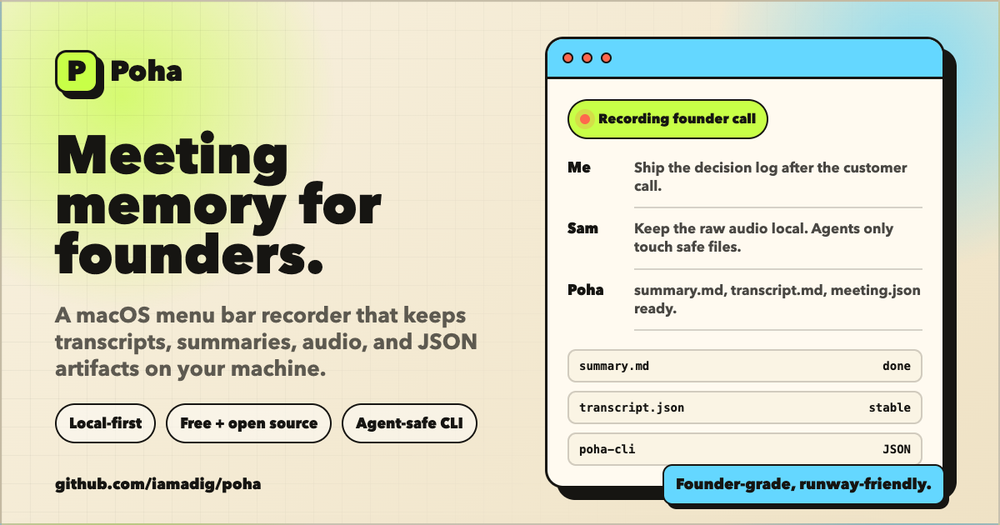
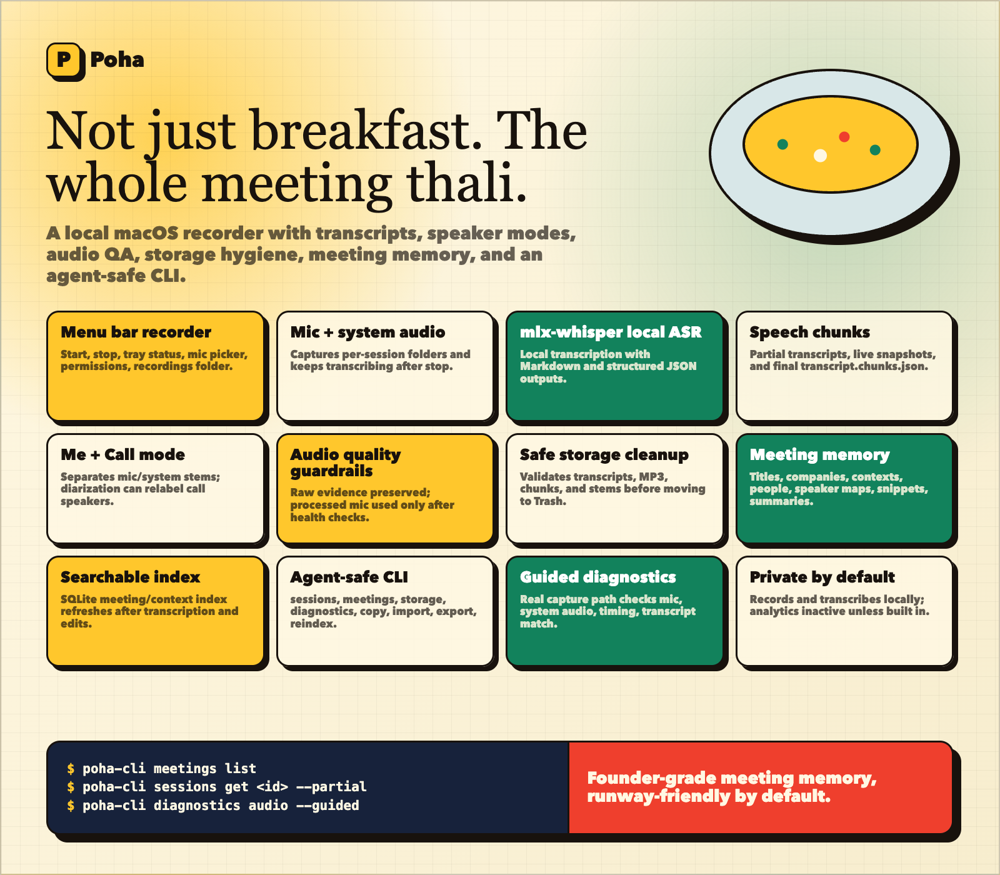

# Poha



Poha is a local-first macOS menu bar meeting recorder. It captures mic and system audio, transcribes locally, writes durable session files, and gives agents a JSON CLI for reading meeting memory safely.

Poha is for breakfast. It is also for founders who want meeting notes without another SaaS seat.

## What It Does



- Records mic and system audio from a macOS menu bar app.
- Transcribes locally with `mlx-whisper` in speech-boundary chunks.
- Writes inspectable artifacts: `summary.md`, `transcript.md`, `transcript.json`, `meeting.json`, audio, and SQLite metadata.
- Supports `Me + Call` speaker modes with separate mic/system stems.
- Runs guided audio diagnostics for mic, system audio, timing, and transcript checks.
- Keeps storage tidy by moving safe-to-clean artifacts to macOS Trash, not hard-deleting them.
- Exposes `poha-cli` for stable JSON reads and constrained agent-safe writes.
- Can invoke Codex for bulk enrichment of missing or stale meeting summaries.
- Defaults local: recording and transcription run on your Mac; no analytics are included.

## Install With Your Agent

Copy this into your coding agent:

```text
Install Poha for me on this Mac.

Repo: https://github.com/Iamadig/poha

Tasks:
1. Check prerequisites: macOS, Xcode command line tools, Rust, Node 22+, pnpm 10+. If something is missing, install it only after telling me what you plan to install.
2. Clone the repo if needed, then run `pnpm install`.
3. Run `pnpm cargo:check` and `pnpm test:cli`.
4. Start the app with `./script/build_and_run.sh`.
5. If macOS asks for Microphone or System Audio permissions, tell me exactly where to grant them.
6. If the app launches, run or explain the guided audio check from the CLI: `poha-cli diagnostics audio --guided`.
7. Do not delete user files. If cleanup is needed, move things to Trash only.
```

## Manual Run

```sh
git clone https://github.com/Iamadig/poha.git
cd poha
pnpm install
./script/build_and_run.sh
```

The script starts `pnpm -F poha tauri:dev`.

Poha does not currently publish signed or notarized binaries. Build from source if you want to test it locally.

## CLI

Use `poha-cli` when agents, scripts, or local automations need meeting data.

```sh
poha-cli meetings list
poha-cli meetings get <meeting-id> --include metadata,transcript,paths
poha-cli sessions list
poha-cli sessions get <session-id> --partial
poha-cli storage maintain --dry-run
poha-cli diagnostics audio --guided
poha-cli recording status
poha-cli recording start --idempotency-key <retry-key>
poha-cli recording stop --current
poha-cli recording stop --session <session-id> --idempotency-key <retry-key>
poha-cli recording stop --retry <retry-key>
```

Agent-safe writes are limited to `summary.md`, `meeting.json`, `.poha/meetings.sqlite`, and `.poha/exports`. Poha does not let the CLI rewrite audio, `session.json`, or transcript evidence.

`recording status` is read-only. `recording start` and `recording stop` are stateful commands that control microphone and system-audio capture in the running Poha app. They use a private same-user Unix socket instead of UI automation. Any process running as your macOS user that can access Poha's control directory is inside that trust boundary, so do not share the directory or its bearer token.

Start and stop retry keys are recorded durably before capture changes. If `--idempotency-key` is omitted, the CLI generates one and returns it for mutation dispatches in both success and error JSON. `--current` first observes a specific active session, creates a new key, and refuses an explicit key; after an uncertain dispatch, use `recording stop --retry <key>`. That retry only reads the durable outcome, and a key Poha never received returns `not found` without stopping anything. These rules prevent duplicate starts and keep an old stop retry from affecting a newer session.

You are responsible for obtaining participant consent and complying with recording laws and organizational policies before starting capture, whether from the menu bar or `poha-cli`.

## Codex Integration

Poha can ask Codex to enrich meetings that need summaries. The app finds missing or stale summaries, invokes the local `codex` CLI, lets Codex read transcripts from the recordings directory, and writes the result back through `poha-cli`.

The boundary is intentional: Codex can annotate, organize, summarize, and export. It cannot rewrite source evidence such as audio, `session.json`, or transcript files.

Useful agent-oriented commands:

```sh
poha-cli meetings list --needs-enrichment
poha-cli capabilities
poha-cli spec
```

Codex enrichment is external AI processing according to your Codex account and backend settings.

## Session Files

Each recording session is file-backed. Important outputs:

- `session.json`
- `meeting.json`
- `summary.md`
- `transcript.md`
- `transcript.partial.md`
- `transcript.json`
- `transcript.live.json`
- `transcript.chunks.json`
- `.poha/meetings.sqlite`

Use `POHA_RECORDINGS_DIR` or `--recordings-dir` to point the CLI at a specific recordings folder.

## Check And Build

```sh
pnpm exec dprint fmt
pnpm cargo:check
pnpm test:cli
pnpm test:lib
pnpm test:transcription
pnpm poha:build
./script/run_live_test.sh
```

`pnpm poha:build` produces a macOS bundle with bundle id `com.iamadig.poha` and the microphone entitlement required for the packaged app.

## Privacy

Poha records and transcribes locally. The standalone app does not include analytics or remote crash reporting.

Codex enrichment is optional and uses the local `codex` CLI. Treat it as external AI processing according to your Codex account and backend settings.

## Project Layout

- `apps/poha/` - Tauri menu bar app.
- `apps/poha/src-tauri/src/bin/poha-cli.rs` - JSON CLI for agents and automations.
- `crates/` and `plugins/` - local Rust crates required by Poha.

## Assets And Licenses

Poha includes local model files, test audio fixtures, UI sounds, icons, and public site images. Source and license notes are tracked in `THIRD_PARTY_NOTICES.md`; keep it current when adding or redistributing bundled assets.
